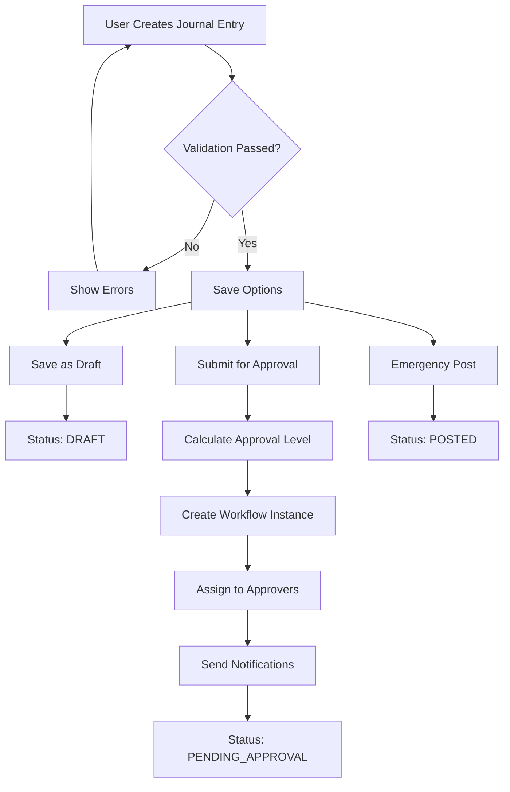
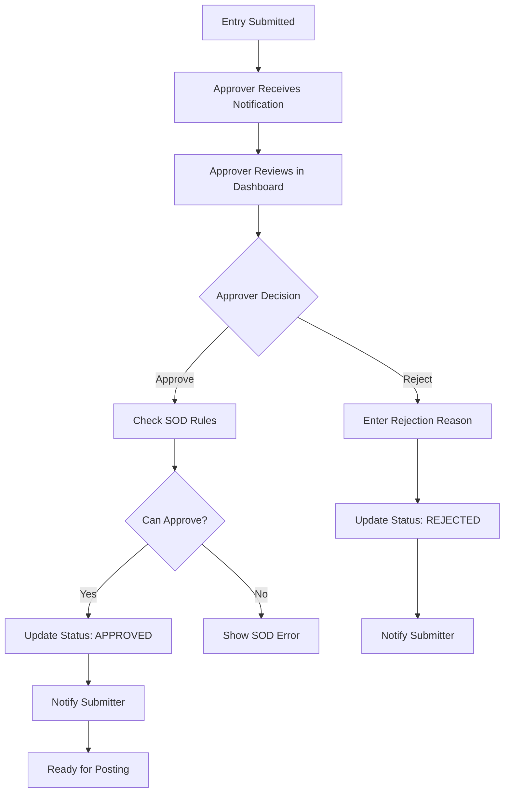

# Enterprise Approval Workflow Module

## Overview

The Enterprise Approval Workflow Module is a comprehensive, SOX-compliant system that manages journal entry approvals with proper segregation of duties, multi-level authorization, and complete audit trail capabilities. This module transforms the journal entry system from basic data entry into a full enterprise-grade workflow management system.

## Table of Contents

- [Architecture Overview](#architecture-overview)
- [Database Schema](#database-schema)
- [Process Flow](#process-flow)
- [User Interfaces](#user-interfaces)
- [Configuration Guide](#configuration-guide)
- [API Documentation](#api-documentation)
- [Security & Compliance](#security--compliance)
- [Testing & QA](#testing--qa)
- [Troubleshooting](#troubleshooting)
- [Appendices](#appendices)

---

## Architecture Overview

### System Components

```
┌─────────────────────────────────────────────────────────────┐
│                 ENTERPRISE APPROVAL WORKFLOW                │
├─────────────────────────────────────────────────────────────┤
│  User Interface Layer                                       │
│  ├── Journal Entry Manager (Enhanced)                       │
│  ├── Approval Dashboard                                     │
│  └── Management Reports                                     │
├─────────────────────────────────────────────────────────────┤
│  Business Logic Layer                                       │
│  ├── WorkflowEngine (Core)                                 │
│  ├── Approval Level Calculator                             │
│  ├── Notification System                                   │
│  └── Audit Logger                                          │
├─────────────────────────────────────────────────────────────┤
│  Data Access Layer                                         │
│  ├── Workflow Database Operations                          │
│  ├── Journal Entry Integration                             │
│  └── User & Permission Management                          │
├─────────────────────────────────────────────────────────────┤
│  Database Layer                                            │
│  ├── Core Workflow Tables (7)                             │
│  ├── Enhanced Journal Entry Tables                        │
│  └── Audit & Logging Tables                               │
└─────────────────────────────────────────────────────────────┘
```

### Key Features

- **Multi-Level Approval System** - Amount-based routing to appropriate approval levels
- **Segregation of Duties (SOD)** - Users cannot approve their own entries
- **Complete Audit Trail** - Every workflow action is logged with timestamps
- **Real-Time Notifications** - Automated notifications to approvers
- **Concurrent Processing** - Safe handling of multiple simultaneous operations
- **Emergency Override** - Special permissions for urgent transactions
- **Status Management** - Complete lifecycle tracking from draft to posting

---

## Database Schema

### Core Tables

#### 1. Enhanced journalentryheader
```sql
ALTER TABLE journalentryheader ADD COLUMN:
- workflow_status VARCHAR(20) DEFAULT 'DRAFT'
- submitted_for_approval_at TIMESTAMP
- submitted_by VARCHAR(50)
- approved_at TIMESTAMP
- approved_by VARCHAR(50)
- rejected_at TIMESTAMP
- rejected_by VARCHAR(50)
- rejection_reason TEXT
- posted_at TIMESTAMP
- posted_by VARCHAR(50)
```

#### 2. approval_levels
```sql
CREATE TABLE approval_levels (
    id SERIAL PRIMARY KEY,
    level_name VARCHAR(50) NOT NULL,
    level_order INTEGER NOT NULL,
    min_amount DECIMAL(15,2) DEFAULT 0,
    max_amount DECIMAL(15,2),
    company_code VARCHAR(5),
    is_active BOOLEAN DEFAULT TRUE
);
```

#### 3. approvers
```sql
CREATE TABLE approvers (
    id SERIAL PRIMARY KEY,
    user_id VARCHAR(50) NOT NULL,
    approval_level_id INTEGER NOT NULL,
    company_code VARCHAR(5),
    is_active BOOLEAN DEFAULT TRUE,
    delegated_to VARCHAR(50),
    delegation_start_date DATE,
    delegation_end_date DATE
);
```

#### 4. workflow_instances
```sql
CREATE TABLE workflow_instances (
    id SERIAL PRIMARY KEY,
    document_number VARCHAR(20) NOT NULL,
    company_code VARCHAR(5) NOT NULL,
    workflow_type VARCHAR(20) DEFAULT 'STANDARD',
    current_step INTEGER DEFAULT 1,
    total_steps INTEGER DEFAULT 1,
    required_approval_level_id INTEGER,
    status VARCHAR(20) DEFAULT 'PENDING',
    created_at TIMESTAMP DEFAULT CURRENT_TIMESTAMP,
    completed_at TIMESTAMP
);
```

#### 5. approval_steps
```sql
CREATE TABLE approval_steps (
    id SERIAL PRIMARY KEY,
    workflow_instance_id INTEGER NOT NULL,
    step_number INTEGER NOT NULL,
    approval_level_id INTEGER NOT NULL,
    assigned_to VARCHAR(50) NOT NULL,
    action VARCHAR(20), -- PENDING, APPROVED, REJECTED
    action_by VARCHAR(50),
    action_at TIMESTAMP,
    comments TEXT,
    time_limit TIMESTAMP
);
```

#### 6. approval_notifications
```sql
CREATE TABLE approval_notifications (
    id SERIAL PRIMARY KEY,
    workflow_instance_id INTEGER NOT NULL,
    recipient VARCHAR(50) NOT NULL,
    notification_type VARCHAR(20) NOT NULL,
    subject VARCHAR(200),
    message TEXT,
    sent_at TIMESTAMP DEFAULT CURRENT_TIMESTAMP,
    read_at TIMESTAMP,
    is_read BOOLEAN DEFAULT FALSE
);
```

#### 7. workflow_audit_log
```sql
CREATE TABLE workflow_audit_log (
    id SERIAL PRIMARY KEY,
    document_number VARCHAR(20) NOT NULL,
    company_code VARCHAR(5) NOT NULL,
    action VARCHAR(50) NOT NULL,
    performed_by VARCHAR(50) NOT NULL,
    performed_at TIMESTAMP DEFAULT CURRENT_TIMESTAMP,
    old_status VARCHAR(20),
    new_status VARCHAR(20),
    comments TEXT,
    ip_address INET,
    user_agent TEXT
);
```

### Data Relationships

```
journalentryheader (1) ←→ (1) workflow_instances
workflow_instances (1) ←→ (n) approval_steps  
workflow_instances (1) ←→ (n) approval_notifications
approval_levels (1) ←→ (n) approvers
approval_levels (1) ←→ (n) workflow_instances
users (1) ←→ (n) approvers
```

---

## Process Flow

### 1. Journal Entry Creation & Submission



### 2. Approval Process Flow



### 3. Detailed Workflow States

| Status | Description | Next Possible States |
|--------|-------------|---------------------|
| **DRAFT** | Entry being prepared | PENDING_APPROVAL, POSTED (emergency) |
| **PENDING_APPROVAL** | Awaiting approval | APPROVED, REJECTED |
| **APPROVED** | Approved by authorized person | POSTED |
| **REJECTED** | Rejected by approver | DRAFT (for revision) |
| **POSTED** | Final posted state | REVERSED (via reversal entry) |
| **CANCELLED** | Workflow cancelled | N/A (terminal state) |

### 4. Approval Level Calculation

```python
def calculate_approval_level(total_amount, company_code):
    """
    Amount-based approval level calculation:
    - Supervisor: $0 - $9,999.99
    - Manager: $10,000 - $99,999.99  
    - Director: $100,000+
    """
    if total_amount < 10000:
        return get_level("Supervisor", company_code)
    elif total_amount < 100000:
        return get_level("Manager", company_code)
    else:
        return get_level("Director", company_code)
```

---

## User Interfaces

### 1. Enhanced Journal Entry Manager

**Location:** `pages/Journal_Entry_Manager.py`

**Key Features:**
- **Save as Draft** - Save work-in-progress entries
- **Submit for Approval** - Primary workflow entry point
- **Emergency Post** - Bypass workflow for urgent entries (requires special permission)
- **Real-time GL Account Validation** - Before submission
- **Enhanced Error Messages** - Clear guidance for users

**Save Options UI:**
```
┌─────────────────────────────────────────────────────────┐
│                     💾 Save Options                     │
├─────────────────────────────────────────────────────────┤
│  [💾 Save as Draft]  [📤 Submit for Approval]  [🚨 Emergency Post]  │
│                                                         │
│  💾 Save as Draft: Save without approval workflow      │
│  📤 Submit for Approval: Route to appropriate approver │
│  🚨 Emergency Post: Requires special permission        │
└─────────────────────────────────────────────────────────┘
```

### 2. Approval Dashboard

**Location:** `pages/Approval_Dashboard.py`

**Key Features:**
- **Pending Approvals Queue** - Real-time list of items awaiting approval
- **Document Review** - Complete entry details before approval decision
- **One-Click Actions** - Approve or reject with comments
- **Performance Analytics** - Approval statistics and timing
- **Auto-Refresh** - Real-time updates for busy approvers

**Dashboard Layout:**
```
┌─────────────────────────────────────────────────────────┐
│                📋 Approval Dashboard                    │
├─────────────────────────────────────────────────────────┤
│  Metrics: [Pending: 5] [Overdue: 1] [Total: $125K] [Approved: 23] │
├─────────────────────────────────────────────────────────┤
│  📄 JE00123 | 1000 - $15,000 ⚠️ OVERDUE               │
│  ├── Created by: john.doe                              │
│  ├── Reference: Monthly Accruals                       │
│  ├── [📋 View Details] [✅ Approve] [❌ Reject]        │
│  └── Comments: _________________________________       │
└─────────────────────────────────────────────────────────┘
```

---

## Configuration Guide

### 1. Setting Up Approval Levels

```sql
-- Example: Configure approval levels for Company 1000
INSERT INTO approval_levels (level_name, level_order, min_amount, max_amount, company_code) VALUES
('Supervisor', 1, 0, 9999.99, '1000'),
('Manager', 2, 10000.00, 99999.99, '1000'),
('Director', 3, 100000.00, NULL, '1000');
```

### 2. Assigning Approvers

```sql
-- Example: Assign users to approval levels
INSERT INTO approvers (user_id, approval_level_id, company_code, is_active) VALUES
('supervisor1', 1, '1000', TRUE),
('manager1', 2, '1000', TRUE),
('director1', 3, '1000', TRUE);
```

### 3. Permission Configuration

Required permissions for users:
- `journal.read` - View journal entries
- `journal.create` - Create journal entries  
- `journal.approve` - Access approval dashboard
- `journal.emergency_post` - Emergency posting capability

### 4. Delegation Setup

```sql
-- Example: Set up delegation from manager1 to supervisor1
UPDATE approvers 
SET delegated_to = 'supervisor1',
    delegation_start_date = '2024-01-01',
    delegation_end_date = '2024-01-31'
WHERE user_id = 'manager1' AND approval_level_id = 2;
```

---

## API Documentation

### WorkflowEngine Class Methods

#### `calculate_required_approval_level(document_number, company_code)`
Calculates the required approval level based on transaction amount.

**Parameters:**
- `document_number` (str): Journal entry document number
- `company_code` (str): Company code for level lookup

**Returns:** 
- `int`: Approval level ID, or None if calculation fails

#### `submit_for_approval(document_number, company_code, submitted_by, comments=None)`
Submits a journal entry for approval workflow.

**Parameters:**
- `document_number` (str): Document to submit
- `company_code` (str): Company code
- `submitted_by` (str): Username of submitter
- `comments` (str, optional): Submission comments

**Returns:**
- `tuple`: (success: bool, message: str)

#### `approve_document(workflow_instance_id, approved_by, comments=None)`
Approves a pending journal entry.

**Parameters:**
- `workflow_instance_id` (int): Workflow instance ID
- `approved_by` (str): Username of approver
- `comments` (str, optional): Approval comments

**Returns:**
- `tuple`: (success: bool, message: str)

#### `reject_document(workflow_instance_id, rejected_by, rejection_reason)`
Rejects a pending journal entry.

**Parameters:**
- `workflow_instance_id` (int): Workflow instance ID
- `rejected_by` (str): Username of rejector
- `rejection_reason` (str): Required rejection reason

**Returns:**
- `tuple`: (success: bool, message: str)

#### `get_pending_approvals(user_id)`
Gets all pending approvals for a specific user.

**Parameters:**
- `user_id` (str): Username of approver

**Returns:**
- `list`: List of pending approval dictionaries

---

## Security & Compliance

### SOX Compliance Features

1. **Segregation of Duties (SOD)**
   - Users cannot approve their own journal entries
   - Enforcement at database and application levels
   - Clear error messages when SOD violations are attempted

2. **Complete Audit Trail**
   - Every workflow action logged with timestamps
   - User identification for all actions
   - Immutable audit records

3. **Authorization Controls**
   - Role-based approval permissions
   - Amount-based approval routing
   - Delegation capabilities with date restrictions

### GAAP Compliance

1. **Proper Documentation**
   - Required comments for rejections
   - Optional comments for approvals
   - Complete transaction history

2. **Internal Controls**
   - Multi-level approval requirements
   - Time limits with escalation capabilities
   - Emergency override procedures with logging

### Data Security

1. **Access Controls**
   - Permission-based UI access
   - Database-level security
   - User session management

2. **Data Integrity**
   - Referential integrity constraints
   - Status validation rules
   - Concurrent operation safety

---

## Testing & QA

### Comprehensive Test Coverage

The module includes a complete QA test suite with 100% pass rate:

- **Database Schema Tests** - Verify all tables and fields exist
- **Configuration Tests** - Validate approval levels and approvers
- **Workflow Engine Tests** - Test core business logic
- **Integration Tests** - End-to-end workflow testing
- **Concurrent Operation Tests** - Multi-user scenario testing
- **Security Tests** - SOD and permission validation

### QA Test Results

```
📊 OVERALL RESULTS:
   Total Tests: 40
   Passed: 40
   Failed: 0
   Pass Rate: 100.0%

✅ QA ASSESSMENT: EXCELLENT - System ready for production
```

### Running Tests

```bash
# Run the comprehensive QA test suite
python3 tests/test_approval_workflow_simple.py
```

---

## Troubleshooting

### Common Issues

#### 1. "No available approvers found"
**Cause:** No approvers configured for the required approval level  
**Solution:** Add approvers to the `approvers` table for the appropriate level

```sql
INSERT INTO approvers (user_id, approval_level_id, company_code, is_active) 
VALUES ('supervisor1', 1, '1000', TRUE);
```

#### 2. "Cannot approve your own journal entry"
**Cause:** SOD violation - user trying to approve their own entry  
**Solution:** This is correct behavior. Have a different user perform the approval

#### 3. "Document not found in database"
**Cause:** Journal entry doesn't exist or wrong document number  
**Solution:** Verify document exists in `journalentryheader` table

#### 4. Workflow status stuck in PENDING_APPROVAL
**Cause:** Approval step not completed or workflow instance corrupted  
**Solution:** Check `approval_steps` table for pending actions

```sql
-- Check workflow status
SELECT wi.*, ast.action, ast.assigned_to 
FROM workflow_instances wi
JOIN approval_steps ast ON ast.workflow_instance_id = wi.id
WHERE wi.document_number = 'JE00123';
```

### Debug Queries

#### Check Workflow Status
```sql
SELECT 
    jeh.documentnumber,
    jeh.workflow_status,
    jeh.submitted_by,
    jeh.approved_by,
    wi.status as workflow_status,
    ast.assigned_to,
    ast.action
FROM journalentryheader jeh
LEFT JOIN workflow_instances wi ON wi.document_number = jeh.documentnumber
LEFT JOIN approval_steps ast ON ast.workflow_instance_id = wi.id
WHERE jeh.documentnumber = 'JE00123';
```

#### Check Available Approvers
```sql
SELECT 
    a.user_id,
    al.level_name,
    al.min_amount,
    al.max_amount,
    a.company_code,
    a.is_active
FROM approvers a
JOIN approval_levels al ON al.id = a.approval_level_id
WHERE a.company_code = '1000' 
AND a.is_active = TRUE;
```

---

## Appendices

### Appendix A: Database Migration Scripts

**File:** `migrations/20250804_150000_add_approval_workflow.sql`

Complete migration script to add all workflow tables and fields.

### Appendix B: Sample Data

#### Sample Approval Levels
```sql
INSERT INTO approval_levels (level_name, level_order, min_amount, max_amount, company_code) VALUES
('Supervisor', 1, 0, 9999.99, '1000'),
('Manager', 2, 10000.00, 99999.99, '1000'),
('Director', 3, 100000.00, NULL, '1000');
```

#### Sample Approvers
```sql
INSERT INTO approvers (user_id, approval_level_id, company_code, is_active) VALUES
('supervisor1', 1, '1000', TRUE),
('manager1', 2, '1000', TRUE),
('director1', 3, '1000', TRUE);
```

### Appendix C: Performance Considerations

1. **Database Indexes**
   - Index on `workflow_status` for quick filtering
   - Index on `assigned_to` for approver lookups
   - Index on `document_number` for workflow lookups

2. **Concurrent Operations**
   - PostgreSQL sequences for document numbering
   - Proper transaction isolation
   - Connection pooling configuration

3. **Caching Strategy**
   - Cache approval levels and approvers
   - Cache user permissions
   - Invalidate cache on configuration changes

### Appendix D: Integration Points

1. **Authentication System**
   - Integrates with existing `auth.middleware`
   - Uses existing user and permission tables
   - Supports role-based access control

2. **Logging System**
   - Integrates with `utils.logger`
   - Structured logging for audit purposes
   - Performance metrics tracking

3. **Navigation System**
   - SAP-style navigation integration
   - Breadcrumb support
   - Consistent UI patterns

---

## Support & Maintenance

### System Requirements
- PostgreSQL 12+
- Python 3.8+
- Streamlit 1.18+
- SQLAlchemy 2.0+

### Deployment Checklist
- [ ] Database migration completed
- [ ] Approval levels configured
- [ ] Approvers assigned
- [ ] Permissions configured
- [ ] QA tests passing
- [ ] User training completed

### Monitoring
- Monitor workflow performance metrics
- Track approval response times
- Alert on overdue approvals
- Audit log analysis

---
**Document Version:** 1.0  
**Last Updated:** August 4, 2025  
**Author:** Enterprise Development Team  
**Status:** Production Ready