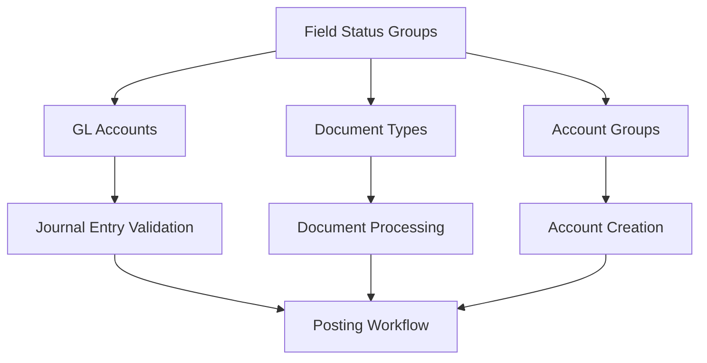

# Field Status Groups - System-Wide Usage Analysis

**Document Version:** 1.0  
**Date:** August 7, 2025  
**Author:** Claude Code Assistant  

## Overview

Field Status Groups are a fundamental control mechanism in the ERP GL system that governs data entry requirements and field validation across all posting transactions. This document provides a comprehensive analysis of how Field Status Groups are implemented and used throughout the system.

## Table of Contents

1. [System Architecture](#system-architecture)
2. [Database Structure](#database-structure)
3. [Business Process Integration](#business-process-integration)
4. [Field Control Patterns](#field-control-patterns)
5. [Current Usage Statistics](#current-usage-statistics)
6. [Application Logic Integration](#application-logic-integration)
7. [Configuration Standards](#configuration-standards)
8. [Impact Analysis](#impact-analysis)
9. [Best Practices](#best-practices)
10. [Future Enhancements](#future-enhancements)

---

## System Architecture

### Core Concept

Field Status Groups control the behavior of data entry fields during GL posting transactions. They determine whether fields are:
- **SUP** (Suppress) - Hidden/not displayed
- **REQ** (Required) - Mandatory for posting
- **OPT** (Optional) - Can be filled
- **DIS** (Display) - Shown but not editable

### Integration Points



---

## Database Structure

### Primary Tables

#### field_status_groups (Main Configuration)
```sql
CREATE TABLE field_status_groups (
    group_id VARCHAR(10) PRIMARY KEY,
    group_name VARCHAR(100) NOT NULL,
    group_description TEXT,
    
    -- Field Status Controls (18+ fields)
    reference_field_status VARCHAR(10) DEFAULT 'OPT',
    document_header_text_status VARCHAR(10) DEFAULT 'OPT',
    assignment_field_status VARCHAR(10) DEFAULT 'OPT',
    cost_center_status VARCHAR(10) DEFAULT 'OPT',
    profit_center_status VARCHAR(10) DEFAULT 'OPT',
    business_area_status VARCHAR(10) DEFAULT 'OPT',
    tax_code_status VARCHAR(10) DEFAULT 'OPT',
    -- ... additional field controls
    
    -- Management Fields
    is_active BOOLEAN DEFAULT TRUE,
    allow_negative_postings BOOLEAN DEFAULT TRUE,
    created_by VARCHAR(50) NOT NULL,
    created_at TIMESTAMP DEFAULT CURRENT_TIMESTAMP
);
```

### Foreign Key Relationships

| Table | Column | References | Purpose |
|-------|--------|------------|---------|
| `glaccount` | `field_status_group` | `field_status_groups.group_id` | Account-level field controls |
| `document_types` | `field_status_group` | `field_status_groups.group_id` | Document-specific overrides |
| `account_groups` | `default_field_status_group` | `field_status_groups.group_id` | Default assignment rules |

---

## Business Process Integration

### 1. Chart of Accounts Management

**Account Creation Process:**
```python
# Automatic field status group assignment
account_group = get_account_group(account_number)
field_status_group = account_group.default_field_status_group

# Validation during account creation
validate_field_status_group_exists(field_status_group)
validate_field_status_group_active(field_status_group)
```

**Impact on GL Accounts:**
- 82 GL accounts currently using field status groups (100% coverage)
- Automatic assignment based on account group classification
- Cascading validation rules applied to all posting transactions

### 2. Document Type Processing

**Document-Specific Controls:**
- Document types can override account-level field status groups
- 21 document types currently configured with field status groups
- Integration with workflow and approval requirements

**Processing Logic:**
```python
# Determine effective field status group
effective_group = (document_type.field_status_group or 
                  account.field_status_group or 
                  account_group.default_field_status_group)
```

### 3. Journal Entry Validation

**Real-Time Field Validation:**
- Field requirements enforced during data entry
- Prevents incomplete postings from proceeding
- Integration with approval workflow requirements

**Validation Process:**
```python
def validate_journal_entry(entry, account):
    field_status = get_field_status_group(account)
    
    if field_status.cost_center_status == 'REQ':
        validate_required_field(entry.cost_center, "Cost Center")
    
    if field_status.profit_center_status == 'REQ':
        validate_required_field(entry.profit_center, "Profit Center")
    
    # Additional field validations...
```

---

## Field Control Patterns

### Standard Field Status Groups (10 Active)

| Group ID | Group Name | Primary Use Case | Accounts | Doc Types |
|----------|------------|------------------|----------|-----------|
| `ASSET01` | Standard Asset Accounts | Asset transactions | 26 | 8 |
| `COGS01` | COGS Account Controls | Manufacturing costs | 23 | 1 |
| `REV01` | Revenue Account Controls | Revenue recognition | 15 | 0 |
| `CASH01` | Cash Account Controls | Cash management | 6 | 4 |
| `PAYB01` | Payables Account Controls | Vendor payments | 6 | 2 |
| `EXP01` | Expense Account Controls | Operating expenses | 4 | 0 |
| `RECV01` | Receivables Account Controls | Customer receivables | 1 | 2 |
| `STAT01` | Statistical Account Controls | Statistical postings | 1 | 0 |
| `INTER01` | Intercompany Controls | Intercompany transactions | 0 | 2 |
| `FIN01` | Financial Account Controls | Financial instruments | 0 | 2 |

### Organizational Field Requirements

#### Cost Center Requirements
```sql
-- Accounts requiring Cost Center (38 total)
COGS01: 23 accounts (REQ)
REV01:  15 accounts (REQ)  
EXP01:   4 accounts (REQ)
```

#### Profit Center Requirements
```sql
-- Accounts requiring Profit Center (62 total)
All groups except ASSET01 (SUP) and CASH01 (SUP)
```

#### Business Area Requirements
```sql
-- Accounts requiring Business Area (42 total)
COGS01: 23 accounts (REQ)
REV01:  15 accounts (REQ)
EXP01:   4 accounts (REQ)
INTER01: 0 accounts (REQ) - Future use
```

#### Tax Code Requirements
```sql
-- Accounts requiring Tax Code (15 total)
REV01: 15 accounts (REQ) - Revenue accounts only
```

---

## Current Usage Statistics

### System-Wide Adoption

| Metric | Count | Coverage |
|--------|--------|----------|
| GL Accounts with Field Status Groups | 82 | 100% |
| Document Types with Field Status Groups | 21 | ~85% |
| Active Field Status Groups | 10 | Complete set |

### Usage Distribution

**By Account Volume:**
```
ASSET01 (26 accounts, 32%) - Asset transactions
COGS01  (23 accounts, 28%) - Manufacturing costs  
REV01   (15 accounts, 18%) - Revenue recognition
Other   (18 accounts, 22%) - Cash, Payables, Expenses
```

**By Field Requirements:**
```
Cost Center Required:     38 accounts (46%)
Profit Center Required:   62 accounts (76%)  
Business Area Required:   42 accounts (51%)
Tax Code Required:        15 accounts (18%)
```

---

## Application Logic Integration

### 1. Field Status Groups Management UI

**Location:** `/pages/Field_Status_Groups_Management.py`

**Features:**
- Complete CRUD operations for field status groups
- Real-time usage analytics and reporting
- Field status matrix visualization
- Clone functionality for creating similar groups
- Bulk operations for maintenance

**Key Functions:**
```python
def show_groups_overview()           # Dashboard with metrics
def show_create_field_status_group() # Creation interface
def show_field_status_analysis()     # Configuration analysis
def show_usage_reports()            # Usage statistics
def show_advanced_configuration()   # Bulk operations
```

### 2. COA Manager Integration

**Location:** `/utils/coa_manager.py`

**Integration Points:**
```python
def get_field_status_group_info(group_id: str) -> Dict[str, Any]:
    """Returns detailed field status group configuration"""
    
def validate_field_status_requirements(account, entry_data):
    """Validates posting data against field status requirements"""
    
def apply_field_status_controls(form_fields, field_status_group):
    """Applies field status controls to UI forms"""
```

### 3. Journal Entry Processing

**Validation Logic:**
```python
class FieldStatusValidator:
    def __init__(self, field_status_group):
        self.field_status = field_status_group
    
    def validate_required_fields(self, entry_data):
        """Validates all required fields are populated"""
        
    def suppress_unnecessary_fields(self, form_config):
        """Hides suppressed fields from UI"""
        
    def set_display_only_fields(self, form_config):
        """Configures display-only fields"""
```

---

## Configuration Standards

### SAP-Aligned Field Status Patterns

#### Revenue Accounts (REV01)
```yaml
Cost Center: REQ      # Required for profitability analysis
Profit Center: REQ    # Required for segment reporting  
Business Area: REQ    # Required for business unit reporting
Tax Code: REQ         # Required for tax compliance
Trading Partner: SUP  # Not applicable for revenue
Payment Terms: SUP    # Not applicable for revenue
```

#### Expense Accounts (EXP01, COGS01)
```yaml
Cost Center: REQ      # Required for cost allocation
Profit Center: REQ    # Required for P&L responsibility
Business Area: REQ    # Required for business analysis
Tax Code: SUP         # Usually not applicable
Trading Partner: SUP  # Not typically used
Payment Terms: SUP    # Not applicable for expenses
```

#### Asset Accounts (ASSET01)
```yaml
Cost Center: SUP      # Not required for assets
Profit Center: OPT    # Optional for asset allocation
Business Area: SUP    # Not typically required
Tax Code: SUP         # Not applicable for assets
Trading Partner: SUP  # Not applicable
Payment Terms: SUP    # Not applicable
```

#### Cash Accounts (CASH01)
```yaml
Cost Center: SUP      # Suppressed for efficiency
Profit Center: SUP    # Suppressed for efficiency
Business Area: SUP    # Suppressed for efficiency
Tax Code: SUP         # Not applicable for cash
Trading Partner: SUP  # Not applicable
Payment Terms: SUP    # Not applicable
```

---

## Impact Analysis

### Business Process Impact

#### Posting Efficiency
- **Streamlined Cash Transactions:** All organizational fields suppressed
- **Comprehensive Revenue Control:** All analytical fields required
- **Balanced Expense Tracking:** Key organizational fields required

#### Data Quality Assurance
- **Mandatory Field Completion:** Prevents incomplete postings
- **Consistent Data Entry:** Standardized requirements across similar accounts
- **Audit Trail:** Complete organizational assignment tracking

#### Compliance Benefits
- **Tax Compliance:** Tax code requirements for revenue accounts
- **Management Reporting:** Consistent profit center and business area assignment
- **Cost Accounting:** Proper cost center assignment for expense tracking

### Performance Considerations

#### Database Performance
```sql
-- Indexes supporting field status group operations
CREATE INDEX idx_glaccount_field_status ON glaccount(field_status_group);
CREATE INDEX idx_document_types_field_status ON document_types(field_status_group);
CREATE INDEX idx_field_status_groups_active ON field_status_groups(is_active);
```

#### Application Performance
- Field status validation occurs at data entry time
- Cached field status configurations for performance
- Minimal overhead during high-volume posting operations

---

## Best Practices

### Configuration Guidelines

#### 1. Account Group Alignment
```yaml
Principle: Account groups should have consistent field status group defaults
Example:
  - All revenue account groups → REV01
  - All expense account groups → EXP01 or COGS01
  - All asset account groups → ASSET01
```

#### 2. Document Type Overrides
```yaml
Principle: Use document type field status groups only for exceptions
Example:
  - Standard journal entries → Use account field status group
  - Special transactions → Override with document-specific group
```

#### 3. Field Status Hierarchy
```yaml
Priority Order:
  1. Document Type Field Status Group (highest priority)
  2. Account Field Status Group
  3. Account Group Default Field Status Group (lowest priority)
```

### Maintenance Procedures

#### Regular Reviews
- **Monthly:** Review usage statistics for unused groups
- **Quarterly:** Validate field status group assignments
- **Annually:** Review and update field status requirements

#### Change Management
- **Impact Analysis:** Assess affected accounts before changes
- **Testing:** Validate posting behavior after field status changes
- **Documentation:** Update configuration documentation

---

## Future Enhancements

### Planned Improvements

#### 1. Dynamic Field Status Assignment
```yaml
Concept: Context-sensitive field status groups
Implementation:
  - Time-based field status rules
  - Amount-based field requirements
  - User role-based field controls
```

#### 2. Enhanced Analytics
```yaml
Features:
  - Field completion rate analysis
  - Posting efficiency metrics
  - User adoption tracking
  - Exception reporting
```

#### 3. Workflow Integration Enhancement
```yaml
Improvements:
  - Field status-aware approval routing
  - Dynamic approval requirements
  - Field completion validation at each approval stage
```

#### 4. API Integration
```yaml
Development:
  - REST API for field status group management
  - Real-time field validation services
  - Integration with external systems
```

### Technical Debt Items

#### 1. Legacy System Compatibility
- Maintain backward compatibility with existing integrations
- Gradual migration of legacy field status references

#### 2. Performance Optimization
- Implement field status caching for high-volume operations
- Optimize validation logic for complex field status hierarchies

---

## Conclusion

Field Status Groups serve as the central control mechanism for data entry requirements in the ERP GL system. With 100% adoption across GL accounts and comprehensive integration throughout business processes, they ensure:

1. **Consistent Data Quality:** Standardized field requirements across similar account types
2. **Process Efficiency:** Optimized data entry with appropriate field controls
3. **Compliance Assurance:** Mandatory organizational assignments for reporting requirements
4. **Flexible Configuration:** Adaptable to different business processes and requirements

The current implementation provides a solid foundation aligned with SAP FI-CO best practices, supporting both operational efficiency and regulatory compliance requirements.

---

## Appendix

### A. Field Status Code Reference

| Code | Description | Behavior |
|------|-------------|----------|
| `SUP` | Suppress | Field is hidden and not displayed in UI |
| `REQ` | Required | Field must be completed before posting |
| `OPT` | Optional | Field can be filled but is not mandatory |
| `DIS` | Display | Field is shown but cannot be edited |

### B. Database Schema Details

#### Complete Field Status Group Structure
```sql
-- All 18+ field status controls available
reference_field_status VARCHAR(10) DEFAULT 'OPT',
document_header_text_status VARCHAR(10) DEFAULT 'OPT',
assignment_field_status VARCHAR(10) DEFAULT 'OPT',
text_field_status VARCHAR(10) DEFAULT 'OPT',
cost_center_status VARCHAR(10) DEFAULT 'OPT',
profit_center_status VARCHAR(10) DEFAULT 'OPT',
business_area_status VARCHAR(10) DEFAULT 'OPT',
trading_partner_status VARCHAR(10) DEFAULT 'SUP',
partner_company_status VARCHAR(10) DEFAULT 'SUP',
tax_code_status VARCHAR(10) DEFAULT 'OPT',
payment_terms_status VARCHAR(10) DEFAULT 'SUP',
baseline_date_status VARCHAR(10) DEFAULT 'SUP',
amount_in_local_currency_status VARCHAR(10) DEFAULT 'DIS',
exchange_rate_status VARCHAR(10) DEFAULT 'OPT',
quantity_status VARCHAR(10) DEFAULT 'SUP',
base_unit_status VARCHAR(10) DEFAULT 'SUP',
house_bank_status VARCHAR(10) DEFAULT 'SUP',
account_id_status VARCHAR(10) DEFAULT 'SUP'
```

### C. Related Documentation

- [COA Management System Documentation](./COA_Management_Deep_Dive.md)
- [Document Type Configuration Guide](./Document_Type_Configuration_Guide.md)
- [Journal Entry Processing Documentation](./Journal_Entry_Processing_Guide.md)

---

**Document Control:**
- **Last Updated:** August 7, 2025
- **Next Review:** November 7, 2025
- **Owner:** ERP GL System Team
- **Approved By:** System Administrator