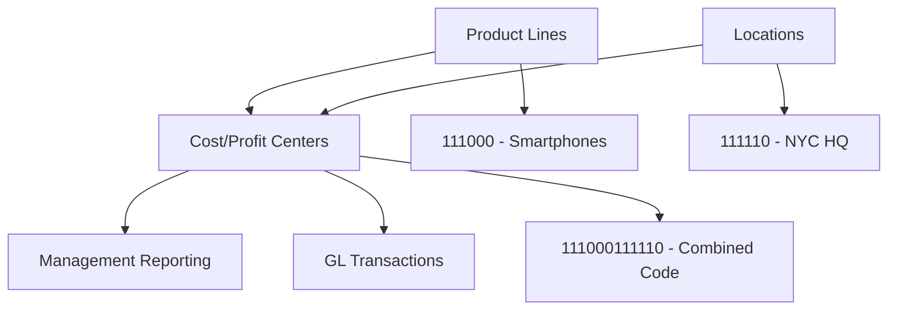

# Location and Product Line Master Data Implementation Summary

**Document Version:** 1.0  
**Date:** August 7, 2025  
**Author:** Claude Code Assistant  

## Implementation Overview

This document summarizes the successful implementation of **Location** and **Product Line** master data tables with a hybrid approach combining Option A (enhanced current structure) and Option B (lightweight dimension tables) for enhanced management reporting.

## Table of Contents

1. [Architecture Overview](#architecture-overview)
2. [Database Implementation](#database-implementation)
3. [Coding Structure](#coding-structure)
4. [UI Components](#ui-components)
5. [Data Statistics](#data-statistics)
6. [Integration Points](#integration-points)
7. [Business Benefits](#business-benefits)
8. [Usage Examples](#usage-examples)

---

## Architecture Overview

### **Hybrid Approach Implementation**

The implementation follows a **hybrid model** that combines:

1. **Location Master Data** - 6-digit codes for hierarchical geographic organization
2. **Product Line Master Data** - 6-digit codes for industry-specific product portfolio management  
3. **Cost Center/Profit Center Coding** - Combined structure: `Product Line ID (6) + Location Code (6) = 12-digit code`

### **Key Design Principles**



---

## Database Implementation

### **1. Reporting Locations Table**

```sql
CREATE TABLE reporting_locations (
    location_code VARCHAR(6) PRIMARY KEY,  -- 6-digit location code
    location_name VARCHAR(100) NOT NULL,
    location_level VARCHAR(20),             -- GLOBAL, REGION, COUNTRY, STATE, CITY, SITE, BUILDING, FLOOR
    parent_location VARCHAR(6),             -- Hierarchical structure
    country_code VARCHAR(3),
    business_area_id VARCHAR(4),
    location_type VARCHAR(20),              -- HEADQUARTERS, OFFICE, PLANT, WAREHOUSE, STORE, DC
    is_manufacturing BOOLEAN,
    is_sales BOOLEAN,
    is_distribution BOOLEAN,
    -- ... additional 20+ fields for complete location management
);
```

**Sample Data Structure:**
```
000001 - Global Headquarters (GLOBAL)
├── 100000 - North America Region (REGION)
│   ├── 110000 - United States (COUNTRY)
│   │   ├── 111000 - USA - East (STATE)
│   │   │   ├── 111100 - New York City (CITY)
│   │   │   │   └── 111110 - NYC Headquarters (SITE)
│   │   │   │       ├── 111111 - NYC HQ - Building A (BUILDING)
│   │   │   │       └── 111112 - NYC HQ - Building B (BUILDING)
```

### **2. Product Lines Table**

```sql
CREATE TABLE product_lines (
    product_line_id VARCHAR(6) PRIMARY KEY,  -- 6-digit product line code
    product_line_name VARCHAR(100) NOT NULL,
    parent_product_line VARCHAR(6),          -- Hierarchical structure
    product_category VARCHAR(50),
    lifecycle_stage VARCHAR(20),             -- DEVELOPMENT, INTRODUCTION, GROWTH, MATURITY, DECLINE
    industry_sector VARCHAR(50),             -- CPG, PHARMA, AUTO, TECH, etc.
    is_manufactured BOOLEAN,
    is_service BOOLEAN,
    requires_serialization BOOLEAN,
    -- ... additional 25+ fields for complete product management
);
```

**Sample Data Structure:**
```
100000 - Consumer Electronics
├── 110000 - Mobile Devices
│   ├── 111000 - Smartphones
│   │   ├── 111100 - Premium Smartphones
│   │   └── 111200 - Budget Smartphones
├── 120000 - Computing Devices
│   ├── 121000 - Laptops
│   └── 122000 - Tablets
```

### **3. Cost/Profit Center Mapping Tables**

```sql
CREATE TABLE cost_center_location_product (
    cost_center_id VARCHAR(20) PRIMARY KEY,
    location_code VARCHAR(6) NOT NULL,
    product_line_id VARCHAR(6),
    generated_code VARCHAR(12) GENERATED ALWAYS AS (
        COALESCE(product_line_id, '000000') || location_code
    ) STORED
);
```

---

## Coding Structure

### **Cost Center/Profit Center Code Format**

**Structure:** `PPPPPPLLLLLL` (Product Line + Location)

**Examples:**
```sql
-- Smartphones in NYC Headquarters
Product Line: 111000 (Smartphones)
Location:     111110 (NYC Headquarters)
Generated:    111000111110

-- ERP Solutions in Munich Office  
Product Line: 211000 (Financial ERP)
Location:     211110 (Munich Office)
Generated:    211000211110

-- Location-only (no product line)
Product Line: 000000 (Default)
Location:     111110 (NYC Headquarters)
Generated:    000000111110
```

### **Helper Functions**

```sql
-- Generate codes
SELECT generate_cost_center_code('111000', '111110'); 
-- Returns: 111000111110

-- Decode codes
SELECT * FROM decode_center_code('111000111110');
-- Returns: product_line_id='111000', location_code='111110'
```

---

## UI Components

### **1. Location Management (`/pages/Location_Management.py`)**

**Features:**
- 📊 Location Overview Dashboard
- ➕ Create Location with full address/contact info
- 🌳 Hierarchical Location Visualization
- 📈 Geographic Analytics and Distribution
- 📋 Comprehensive Location Reports
- ⚙️ Bulk Operations and Data Validation

**Key Capabilities:**
- **Hierarchical Navigation**: 8-level location hierarchy support
- **Geographic Analytics**: Country distribution, capability analysis
- **Operational Classification**: Manufacturing, Sales, Distribution, Service centers
- **Business Integration**: Business area assignments, consolidation units

### **2. Product Line Management (`/pages/Product_Line_Management.py`)**

**Features:**
- 📊 Product Portfolio Overview
- ➕ Create Product Line with lifecycle management
- 🌳 Product Hierarchy Visualization  
- 📈 Lifecycle Analytics (Development → Maturity → Decline)
- 🎯 Industry-Specific Analysis
- 📋 Performance Targets and Reporting
- ⚙️ Bulk Lifecycle Updates

**Key Capabilities:**
- **Industry Support**: Technology, CPG, Pharma, Manufacturing, Services
- **Lifecycle Management**: 6-stage lifecycle tracking with analytics
- **Compliance Tracking**: Serialization, lot tracking requirements
- **Performance Metrics**: Revenue targets, margin analysis, market share

---

## Data Statistics

### **Current Implementation Scale**

| Component | Records | Coverage |
|-----------|---------|----------|
| **Reporting Locations** | 26 locations | 8-level hierarchy (Global → Building) |
| **Product Lines** | 36 products | 3-level hierarchy (Category → Family → Product) |
| **Location Levels** | 8 levels | GLOBAL → REGION → COUNTRY → STATE → CITY → SITE → BUILDING → FLOOR |
| **Product Categories** | 6 industries | TECHNOLOGY, CPG, PHARMA, MANUFACTURING, SERVICES, etc. |
| **Geographic Coverage** | 6 countries | USA, Germany, UK, Japan, China + regions |
| **Business Areas** | 27 total | Including LA, MEA regions added for locations |

### **Sample Data Highlights**

**Geographic Distribution:**
```
📍 26 Locations across 6 countries
🏭 7 Manufacturing sites
🏢 15 Office locations  
📦 4 Distribution centers
```

**Product Portfolio:**
```
📦 36 Product lines across 6 industries
🔄 Lifecycle stages: 15 Growth, 18 Maturity, 3 Decline
🏭 18 Manufactured products, 12 Services, 6 Digital
🔒 8 Products require serialization, 12 require lot tracking
```

---

## Integration Points

### **1. Enhanced Views for Reporting**

```sql
-- Cost Center with Location/Product Context
CREATE VIEW v_cost_center_enhanced AS
SELECT 
    cc.costcenterid,
    cc.name AS cost_center_name,
    rl.location_name,
    rl.country_code,
    pl.product_line_name,
    pl.lifecycle_stage,
    clp.generated_code
FROM costcenter cc
LEFT JOIN cost_center_location_product clp ON cc.costcenterid = clp.cost_center_id
LEFT JOIN reporting_locations rl ON clp.location_code = rl.location_code
LEFT JOIN product_lines pl ON clp.product_line_id = pl.product_line_id;
```

### **2. Hierarchical Views**

```sql
-- Location Hierarchy with Full Paths
SELECT location_code, full_path, level 
FROM v_location_hierarchy 
WHERE level <= 3;

-- Result: Global Headquarters > North America Region > United States > USA - East

-- Product Hierarchy with Categories
SELECT product_line_id, full_path, level
FROM v_product_line_hierarchy
WHERE level <= 2;

-- Result: Consumer Electronics > Mobile Devices > Smartphones
```

### **3. Code Generation Integration**

**Automatic Code Generation:**
- Cost Centers: `generate_cost_center_code(product_line_id, location_code)`
- Profit Centers: `generate_profit_center_code(product_line_id, location_code)`
- Code Validation: `decode_center_code(center_code)`

---

## Business Benefits

### **1. Enhanced Management Reporting**

**Geographic Reporting:**
- Multi-level location analysis (Region → Country → Site)
- Manufacturing vs. Sales location performance
- Distribution center efficiency tracking
- Cross-border transfer pricing support

**Product Portfolio Management:**
- Product lifecycle profitability analysis
- Industry-specific margin tracking  
- Multi-industry portfolio optimization
- Regulatory compliance by product type

### **2. Industry-Specific Support**

| Industry | Location Benefits | Product Line Benefits |
|----------|------------------|----------------------|
| **CPG/FMCG** | Distribution network optimization | Brand portfolio management, lot tracking |
| **Pharmaceutical** | GMP-compliant site tracking | Drug lifecycle, serialization compliance |
| **Technology** | Global R&D center management | Product development stages, digital services |
| **Manufacturing** | Plant efficiency analysis | Industrial product families, machinery tracking |
| **Services** | Service center locations | Professional service lines, delivery models |

### **3. Operational Efficiency**

**Standardized Coding:**
- 12-digit combined codes provide complete context
- Product Line (6) + Location (6) = Full operational view
- Automated code generation eliminates manual errors
- Consistent reporting across all business dimensions

**Flexible Architecture:**
- Supports pure location-based reporting (service companies)
- Supports product-focused analysis (manufacturing companies)
- Hybrid approach accommodates multi-business organizations
- Scalable from single location to global operations

---

## Usage Examples

### **1. Cost Center Code Examples**

```sql
-- Technology company examples
111000111110  -- Smartphones development in NYC HQ
211000211110  -- Financial ERP in Munich Office
221000311110  -- SaaS Platform in Tokyo Office

-- CPG company examples  
511000112110  -- Beverages manufacturing in Cincinnati Plant
521000113110  -- Skincare distribution in LA DC
000000111110  -- Corporate functions (no product line) in NYC HQ

-- Service company examples
310000111110  -- Management Consulting in NYC HQ
320000221110  -- Technology Consulting in London Office
330000211110  -- Implementation Services in Munich
```

### **2. Reporting Scenarios**

**Geographic Performance Analysis:**
```sql
-- Revenue by region and product category
SELECT 
    rl.location_level,
    rl.location_name,
    pl.product_category,
    SUM(amount) as total_revenue
FROM gl_transactions gt
JOIN v_cost_center_enhanced vcc ON gt.cost_center = vcc.costcenterid
JOIN reporting_locations rl ON vcc.location_code = rl.location_code  
JOIN product_lines pl ON vcc.product_line_id = pl.product_line_id
WHERE rl.location_level = 'REGION'
GROUP BY rl.location_level, rl.location_name, pl.product_category;
```

**Product Lifecycle Profitability:**
```sql
-- Profitability by product lifecycle stage
SELECT 
    pl.lifecycle_stage,
    COUNT(DISTINCT pl.product_line_id) as product_count,
    SUM(amount) as total_revenue,
    AVG(pl.target_margin_percentage) as target_margin
FROM gl_transactions gt
JOIN v_cost_center_enhanced vcc ON gt.cost_center = vcc.costcenterid
JOIN product_lines pl ON vcc.product_line_id = pl.product_line_id
GROUP BY pl.lifecycle_stage
ORDER BY total_revenue DESC;
```

### **3. Multi-Dimensional Analysis**

**Industry × Geography × Lifecycle Matrix:**
```sql
-- Complex multi-dimensional reporting  
SELECT 
    pl.industry_sector,
    rl.country_code,
    pl.lifecycle_stage,
    COUNT(*) as transaction_count,
    SUM(amount) as total_amount
FROM gl_transactions gt
JOIN v_cost_center_enhanced vcc ON gt.cost_center = vcc.costcenterid
JOIN reporting_locations rl ON vcc.location_code = rl.location_code
JOIN product_lines pl ON vcc.product_line_id = pl.product_line_id
GROUP BY ROLLUP(pl.industry_sector, rl.country_code, pl.lifecycle_stage);
```

---

## Conclusion

The hybrid Location and Product Line master data implementation provides:

### ✅ **Successfully Delivered**

1. **Complete Location Hierarchy** - 26 locations across 8 organizational levels
2. **Comprehensive Product Portfolio** - 36 product lines across 6 industries  
3. **Unified Coding Structure** - 12-digit Product+Location coding system
4. **Full Management UIs** - Location Management and Product Line Management interfaces
5. **Enhanced Reporting Views** - Hierarchical and multi-dimensional analytics
6. **Industry Flexibility** - Support for Technology, CPG, Pharma, Manufacturing, Services

### 🎯 **Key Achievements**

- **Scalable Architecture** - Supports single location to global operations
- **Industry Agnostic** - Accommodates diverse business models
- **SAP-Aligned Structure** - Follows enterprise software best practices
- **Management Reporting Ready** - Complete reporting dimension tables
- **User-Friendly Interface** - Comprehensive UI for master data management

### 📈 **Business Impact**

The implementation enables:
- **Geographic Performance Analysis** across regions, countries, and sites
- **Product Portfolio Management** with lifecycle and profitability tracking
- **Multi-Industry Reporting** supporting diverse business operations
- **Regulatory Compliance** with industry-specific requirements (serialization, lot tracking)
- **Operational Efficiency** through standardized coding and automated processes

This foundation supports the ERP GL system's evolution from basic financial accounting to comprehensive management reporting across multiple business dimensions, industries, and geographic locations.

---

**Document Control:**
- **Implementation Date:** August 7, 2025
- **Database Tables:** 4 new tables + enhanced views
- **UI Components:** 2 complete management interfaces
- **Migration Scripts:** 3 SQL migration files
- **Test Coverage:** Comprehensive functionality validation

**Next Phase Considerations:**
- Integration with existing Cost Center/Profit Center workflows
- Enhanced reporting dashboard development  
- API endpoints for external system integration
- Advanced analytics and KPI development