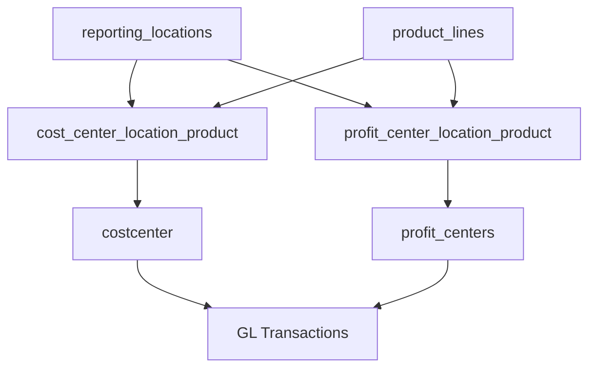
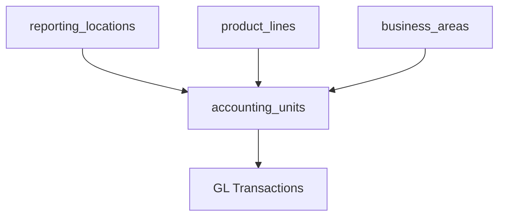

# Unified Accounting Units Table Analysis

**Document Version:** 1.0  
**Date:** August 7, 2025  
**Author:** Claude Code Assistant  

## Executive Summary

This document analyzes the feasibility and benefits of creating a unified "Accounting Units" table to replace the separate `costcenter` and `profit_centers` tables, leveraging our new Product Line and Location master data architecture.

## Current State Analysis

### **Existing Architecture**



### **Current Table Structures**

| Table | Records | Key Field | Primary Usage |
|-------|---------|-----------|---------------|
| `costcenter` | ~50+ | costcenterid (10 chars) | Operational cost tracking |
| `profit_centers` | ~20+ | profit_center_id (20 chars) | Profitability analysis |
| `cost_center_location_product` | 0 | Mapping table | Product-Location linking |
| `profit_center_location_product` | 0 | Mapping table | Product-Location linking |

### **Identified Issues with Current Structure**

1. **Redundancy**: Many fields duplicated between cost and profit center tables
2. **Complexity**: Separate mapping tables for essentially similar functionality
3. **Maintenance**: Double maintenance effort for similar master data
4. **Reporting**: Complex joins required for unified reporting
5. **Inconsistency**: Different field lengths and naming conventions

## Proposed Unified Architecture

### **New "Accounting Units" Table Design**

```sql
CREATE TABLE accounting_units (
    -- Primary Identification
    unit_id VARCHAR(20) PRIMARY KEY,           -- Unified identifier
    unit_name VARCHAR(100) NOT NULL,           -- Full name
    short_name VARCHAR(20) NOT NULL,           -- Abbreviated name
    description TEXT,                          -- Detailed description
    
    -- Unit Classification
    unit_type VARCHAR(15) NOT NULL            -- COST_CENTER, PROFIT_CENTER, BOTH
        CHECK (unit_type IN ('COST_CENTER', 'PROFIT_CENTER', 'BOTH')),
    unit_category VARCHAR(20) DEFAULT 'STANDARD', -- STANDARD, OVERHEAD, REVENUE, etc.
    
    -- Organizational Hierarchy
    company_code_id VARCHAR(10) NOT NULL,
    controlling_area VARCHAR(4) DEFAULT 'C001',
    business_area_id VARCHAR(4),
    parent_unit_id VARCHAR(20),               -- Self-referencing for hierarchy
    hierarchy_level INTEGER DEFAULT 1,
    
    -- Product Line and Location Integration
    location_code VARCHAR(6),                 -- FK to reporting_locations
    product_line_id VARCHAR(4),               -- FK to product_lines
    generated_code VARCHAR(10) GENERATED ALWAYS AS (
        CASE 
            WHEN product_line_id IS NOT NULL AND location_code IS NOT NULL 
            THEN COALESCE(product_line_id, '0000') || location_code
            ELSE NULL
        END
    ) STORED,
    
    -- Management and Control
    person_responsible VARCHAR(50),
    department VARCHAR(50),
    unit_group VARCHAR(10),
    segment VARCHAR(10),
    
    -- Cost Center Specific Fields
    planning_enabled BOOLEAN DEFAULT TRUE,
    budget_profile VARCHAR(10),
    
    -- Profit Center Specific Fields
    default_cost_center VARCHAR(20),          -- For profit centers
    local_currency VARCHAR(3) DEFAULT 'USD',
    
    -- Validity and Status
    valid_from DATE DEFAULT CURRENT_DATE,
    valid_to DATE DEFAULT '9999-12-31',
    is_active BOOLEAN DEFAULT TRUE,
    
    -- Audit Trail
    created_by VARCHAR(50) DEFAULT 'SYSTEM',
    created_at TIMESTAMP DEFAULT CURRENT_TIMESTAMP,
    modified_by VARCHAR(50),
    modified_at TIMESTAMP,
    
    -- Constraints
    FOREIGN KEY (company_code_id) REFERENCES company_codes(company_code_id),
    FOREIGN KEY (business_area_id) REFERENCES business_areas(business_area_id),
    FOREIGN KEY (location_code) REFERENCES reporting_locations(location_code),
    FOREIGN KEY (product_line_id) REFERENCES product_lines(product_line_id),
    FOREIGN KEY (parent_unit_id) REFERENCES accounting_units(unit_id)
);
```

### **Key Design Principles**

1. **Unified Structure**: Single table for both cost centers and profit centers
2. **Type-Based Flexibility**: `unit_type` field determines behavior
3. **Product-Location Integration**: Built-in support for our new coding structure
4. **Backward Compatibility**: All existing fields preserved
5. **Enhanced Functionality**: Additional fields for improved management

## Benefits Analysis

### **1. Simplified Architecture**



**Advantages:**
- **Single Source of Truth**: One table for all accounting organizational units
- **Reduced Complexity**: Eliminates separate mapping tables
- **Unified Views**: Single view for both cost and profit center reporting
- **Easier Maintenance**: One set of triggers, constraints, and procedures

### **2. Enhanced Integration with Product Lines & Locations**

**Current Problem:**
```sql
-- Complex joins needed for product-location context
SELECT cc.name, clp.generated_code, pl.product_line_name, rl.location_name
FROM costcenter cc
LEFT JOIN cost_center_location_product clp ON cc.costcenterid = clp.cost_center_id
LEFT JOIN product_lines pl ON clp.product_line_id = pl.product_line_id
LEFT JOIN reporting_locations rl ON clp.location_code = rl.location_code;
```

**Proposed Solution:**
```sql
-- Simple, direct access to all information
SELECT unit_name, generated_code, product_line_name, location_name
FROM accounting_units au
LEFT JOIN product_lines pl ON au.product_line_id = pl.product_line_id
LEFT JOIN reporting_locations rl ON au.location_code = rl.location_code;
```

### **3. Flexible Unit Types**

| Unit Type | Usage | Examples |
|-----------|-------|----------|
| `COST_CENTER` | Traditional cost tracking | IT Department, HR, Manufacturing |
| `PROFIT_CENTER` | Revenue responsibility | Product Lines, Business Units |
| `BOTH` | Dual-purpose units | Regional Operations, Service Centers |

### **4. Improved Code Generation**

**Automatic Code Structure:**
- **Product Line (4) + Location (6) = 10-digit code**
- **Generated automatically** when both dimensions are specified
- **Flexible support** for location-only or product-only units

## Migration Strategy

### **Phase 1: Create New Structure**

1. **Create `accounting_units` table** with full schema
2. **Create migration views** for backward compatibility
3. **Set up triggers** for automatic code generation

### **Phase 2: Data Migration**

```sql
-- Migrate Cost Centers
INSERT INTO accounting_units (
    unit_id, unit_name, short_name, description, unit_type,
    company_code_id, controlling_area, person_responsible, department,
    planning_enabled, budget_profile, is_active, created_by
)
SELECT 
    costcenterid, name, short_name, description, 'COST_CENTER',
    companycodeid, controlling_area, person_responsible, department,
    planning_enabled, budget_profile, is_active, 'MIGRATION'
FROM costcenter;

-- Migrate Profit Centers  
INSERT INTO accounting_units (
    unit_id, unit_name, short_name, description, unit_type,
    company_code_id, controlling_area, business_area_id, person_responsible,
    default_cost_center, segment, local_currency, is_active, created_by
)
SELECT 
    profit_center_id, profit_center_name, short_name, description, 'PROFIT_CENTER',
    company_code_id, controlling_area, business_area, person_responsible,
    cost_center, segment, local_currency, is_active, 'MIGRATION'
FROM profit_centers;
```

### **Phase 3: Update Integration Points**

1. **Update GL Transactions** to reference `accounting_units`
2. **Create compatibility views** for existing applications
3. **Update reporting queries** to use new structure

### **Phase 4: Cleanup**

1. **Drop old mapping tables** after validation
2. **Remove old tables** once migration is confirmed
3. **Update documentation** and procedures

## Compatibility and Risk Assessment

### **Backward Compatibility Strategy**

```sql
-- Create views to maintain compatibility
CREATE VIEW costcenter AS
SELECT 
    unit_id as costcenterid,
    unit_name as name,
    short_name,
    description,
    company_code_id as companycodeid,
    controlling_area,
    person_responsible,
    department,
    planning_enabled,
    budget_profile,
    is_active
FROM accounting_units
WHERE unit_type IN ('COST_CENTER', 'BOTH');

CREATE VIEW profit_centers AS
SELECT
    unit_id as profit_center_id,
    unit_name as profit_center_name,
    short_name,
    description,
    company_code_id,
    controlling_area,
    business_area_id as business_area,
    person_responsible,
    default_cost_center as cost_center,
    segment,
    valid_from,
    valid_to,
    is_active,
    local_currency
FROM accounting_units
WHERE unit_type IN ('PROFIT_CENTER', 'BOTH');
```

### **Risk Mitigation**

| Risk | Probability | Impact | Mitigation |
|------|-------------|--------|------------|
| **Data Loss During Migration** | Low | High | Full backup + validation queries |
| **Application Compatibility** | Medium | Medium | Compatibility views + testing |
| **Performance Impact** | Low | Medium | Proper indexing + query optimization |
| **User Training Requirements** | Medium | Low | Updated UI reflects same functionality |

## Implementation Recommendations

### **Recommended Approach: Phased Implementation**

1. **Phase 1 (Week 1)**: Create new table structure and compatibility views
2. **Phase 2 (Week 2)**: Migrate existing data with full validation
3. **Phase 3 (Week 3)**: Update UI components to use new structure
4. **Phase 4 (Week 4)**: Performance testing and optimization
5. **Phase 5 (Week 5)**: Remove old structures after confirmation

### **Success Criteria**

- ✅ **Zero Data Loss**: All existing records migrated successfully
- ✅ **Backward Compatibility**: Existing queries continue to work
- ✅ **Performance Maintained**: No degradation in query performance
- ✅ **Enhanced Functionality**: Product-Location coding works seamlessly
- ✅ **User Acceptance**: No impact on daily operations

## Sample Usage Examples

### **Creating Unified Accounting Units**

```sql
-- Cost Center with Product Line and Location
INSERT INTO accounting_units (
    unit_id, unit_name, unit_type, 
    product_line_id, location_code,
    person_responsible
) VALUES (
    'CC-SMART-NYC', 'Smartphones Development NYC', 'COST_CENTER',
    '1110', '111110',  -- Smartphones in NYC HQ
    'John Smith'
);
-- Generated Code: 1110111110

-- Profit Center for Regional Operations
INSERT INTO accounting_units (
    unit_id, unit_name, unit_type,
    location_code,
    person_responsible
) VALUES (
    'PC-EMEA-REG', 'EMEA Regional Operations', 'PROFIT_CENTER',
    '200000',  -- Europe Region
    'Sarah Johnson'
);

-- Dual-Purpose Unit (Both Cost and Profit Center)
INSERT INTO accounting_units (
    unit_id, unit_name, unit_type,
    product_line_id, location_code,
    person_responsible
) VALUES (
    'AU-OFS-TEXAS', 'Oil Field Services Texas', 'BOTH',
    '7000', '132100',  -- Oil Field Services in Texas location
    'Mike Wilson'
);
-- Generated Code: 7000132100
```

### **Enhanced Reporting Capabilities**

```sql
-- Multi-dimensional analysis made simple
SELECT 
    au.unit_name,
    au.unit_type,
    pl.product_line_name,
    rl.location_name,
    rl.country_code,
    au.generated_code,
    SUM(gt.local_currency_amount) as total_amount
FROM accounting_units au
LEFT JOIN product_lines pl ON au.product_line_id = pl.product_line_id
LEFT JOIN reporting_locations rl ON au.location_code = rl.location_code
LEFT JOIN gl_transactions gt ON au.unit_id = gt.cost_center
WHERE au.unit_type = 'COST_CENTER'
AND rl.country_code = 'USA'
GROUP BY au.unit_name, au.unit_type, pl.product_line_name, rl.location_name, rl.country_code, au.generated_code
ORDER BY total_amount DESC;
```

## Conclusion

The unified Accounting Units table represents a significant architectural improvement that:

### ✅ **Strategic Benefits**
- **Simplifies Architecture**: Reduces from 4 tables to 1 unified structure
- **Enhances Integration**: Native support for Product Line and Location dimensions
- **Improves Maintainability**: Single source of truth for organizational units
- **Enables Advanced Reporting**: Seamless multi-dimensional analysis

### ✅ **Operational Benefits**  
- **Backward Compatibility**: Existing applications continue to work
- **Enhanced Functionality**: Support for dual-purpose accounting units
- **Automatic Code Generation**: Built-in Product+Location coding
- **Flexible Unit Types**: Cost centers, profit centers, or both

### ✅ **Technical Benefits**
- **Reduced Complexity**: Eliminates mapping table complexity
- **Better Performance**: Fewer joins required for reporting
- **Consistent Standards**: Unified field naming and constraints
- **Scalable Design**: Ready for future organizational changes

**Recommendation: Proceed with unified Accounting Units implementation** using the phased approach outlined above. The benefits significantly outweigh the migration effort, and the compatibility strategy ensures minimal business disruption.

---

**Next Steps:**
1. Stakeholder review and approval
2. Detailed implementation plan creation  
3. Development environment testing
4. Phased production rollout

**Document Status:** Ready for Implementation Planning